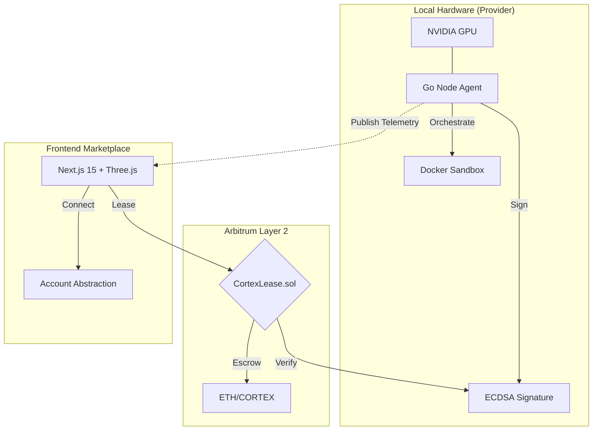

# 🌌 CORTEX GRID
**The Decentralized Physical Infrastructure (DePIN) for High-Performance Compute.**

CortexGrid bridges raw hardware power to the Arbitrum ecosystem, enabling a trustless, peer-to-peer GPU marketplace. This project demonstrates high-concurrency systems programming, cryptographic verification protocols, and premium frontend architecture.

[](#)
[](#)
[](#)
[](#)

---

## 🏛️ Engineering Philosophy
CortexGrid isn't just a marketplace; it's a solution to the "Inference Gap." Centralized clouds are expensive and opaque. We solve this through:
- **Verifiable Uptime**: Cryptographic proof that hardware is actually online.
- **Secure Isolation**: Multi-tenant GPU access via kernel-level sandboxing.
- **Economic Truth**: Smart-contract based escrow that eliminates counterparty risk.

## 🛠️ Technical Deep Dive

### 1. The High-Performance Node Agent (Go)
The `node-agent` is the heartbeat of the network. Built in **Go** for its superior concurrency model and low-level system bindings:
*   **Hardware Telemetry**: Direct integration with `nvidia-smi` to pull real-time VRAM, TFLOPS, and thermals.
*   **Cryptographic Heartbeats**: Every 60s, the agent signs a unique timestamp using **secp256k1 (ECDSA)** via the provider's local key. This is the foundation of our **Proof-of-Uptime**.
*   **Docker Lifecycle Management**: Leverages the Docker SDK to dynamically spin up, monitor, and prune sandboxed environments for compute jobs, ensuring provider security.

### 2. On-Chain Verification & Escrow (Solidity)
The `CortexLease.sol` contract acts as the network's decentralized judge:
*   **Signature Recovery**: Uses OpenZeppelin's `ECDSA` to recover provider addresses from heartbeats on-chain, preventing identity spoofing.
*   **Automated Slashing**: A time-windowed logic (`block.timestamp > lastHeartbeat + 120s`) enables users to automatically reclaim funds and slash provider reputations if nodes fail.
*   **Non-Custodial Escrow**: Funds are locked in the contract and only released to the provider once the consumer confirms job completion—or proportional to verified uptime milestones.

### 3. Account Abstraction & UX (Next.js 15)
To bridge the gap between Web2 developers and Web3 finance, we've implemented:
*   **Social Onboarding**: (Simulated) Account Abstraction logic allows users to sign in with Google/GitHub, abstracting away gas fees and mnemonic management.
*   **Real-time Visualization**: High-fidelity global node visualization using **Three.js (R3F)** and **Framer Motion**, providing a "Bloomberg Terminal" feel for GPU assets.

---

## 🏗️ System Architecture



---

## � Project Structure & Clean Code
This repository follows strict modularity and separation of concerns:
*   `📂 node-agent`: Clean Architecture in Go. Decoupled hardware, docker, and contract layers.
*   `📂 contracts`: Foundry-ready Solidity suite with comprehensive security inheritance.
*   `📂 marketplace-ui`: Modern React patterns (Server Components, Custom Hooks) for scalable dashboard development.

---

## � Getting Started

### Prerequisites
*   **Go** 1.21+
*   **Node.js** 18+
*   **Docker** (for node providers)
*   **NVIDIA Drivers** (optional, for real hardware metrics)

### Local Dev Setup
1. **Contract Deployment**:
   ```bash
   cd contracts && forge build
   ```
2. **Launch Node Agent**:
   ```bash
   cd node-agent && go run main.go
   ```
3. **Start Dashboard**:
   ```bash
   cd marketplace-ui && npm install && npm run dev
   ```

---

## 🔮 Roadmap: The Road to L3
- [ ] **Arbitrum Stylus Migration**: Porting heartbeat verification to Rust for 10x gas efficiency.
- [ ] **ZK-Uptime**: Using zero-knowledge proofs to verify hardware TFLOPS without leaking sensitive logs.
- [ ] **Cross-Chain Compute**: Enabling GPU rentals across multiple L2s via LayerZero snapshots.

---
**CortexGrid** | *Professional-grade DePIN for the AI Era.*
