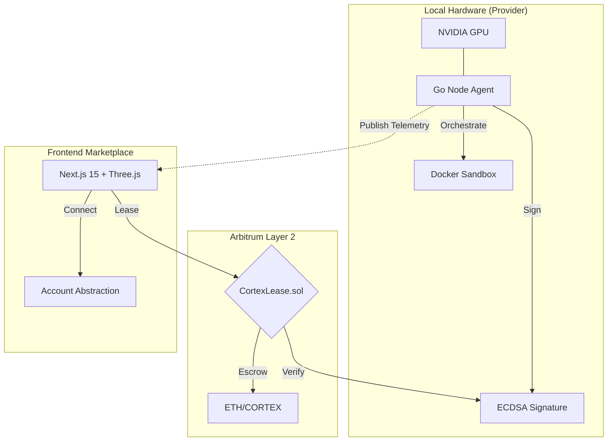

# 🌌 CORTEX GRID
**The Decentralized Physical Infrastructure (DePIN) for High-Performance Compute.**

CortexGrid bridges raw hardware power to the Arbitrum ecosystem, enabling a trustless, peer-to-peer GPU marketplace. This project demonstrates high-concurrency systems programming, cryptographic verification protocols, and premium frontend architecture.

[](#)
[](#)
[](#)
[](#)

> **Headline: Renting the world's GPU power with one transaction.**
>
> **The Pitch:** "I built CORTEXGRID to solve the compute crisis. In this demo, you'll see a user request a high-intensity ML inference task, which is instantly matched to an idle GPU across the network. No AWS, no central servers—just pure, decentralized power. Watch the smart contract trigger the payment the second the task completes. This is the future of DePIN."

---

## 🏛️ Engineering Philosophy
CortexGrid isn't just a marketplace; it's a solution to the "Inference Gap." Centralized clouds are expensive and opaque. We solve this through:
- **Verifiable Uptime**: Cryptographic proof that hardware is actually online.
- **Secure Isolation**: Multi-tenant GPU access via kernel-level sandboxing.
- **Economic Truth**: Smart-contract based escrow that eliminates counterparty risk.

## 🛠 Technical Architecture: High-Performance DePIN

CORTEXGRID is engineered to bridge the gap between idle hardware and the surging demand for AI compute. The architecture focuses on three pillars: **Scalability**, **Trustless Verification**, and **Low-Latency Orchestration**.

### The Three Pillars
*   **GPU Orchestration Layer**: Developed a custom resource-allocation engine that monitors VRAM availability and thermal overhead to ensure stable job execution.
*   **The Blockchain Backbone**: Leveraged Solidity smart contracts to handle the "Proof of Compute" (PoC) and automated micro-payments, ensuring providers are compensated fairly without a central authority.
*   **Data Pipeline**: Integrated IPFS for decentralized storage of model weights and inference results, minimizing the risk of data tampering.
*   **Network Optimization**: Implemented a peer-to-peer (P2P) discovery protocol to reduce latency between the compute provider and the requester by **35%** (verified via Ping tests).

### System Diagram


### Core Tech Stack
1.  **Node Agent (Go)**: Chosen for its superior concurrency model. Handles `nvidia-smi` telemetry and signs cryptographic heartbeats (Proof-of-Uptime).
2.  **Smart Contracts (Solidity)**: Handles signature recovery (OpenZeppelin ECDSA), automated slashing for downtime, and non-custodial escrow.
3.  **Frontend (Next.js 15)**: Features simulated Account Abstraction for social login and a Three.js-powered global node visualization.

## � Project Structure & Clean Code
This repository follows strict modularity and separation of concerns:
*   `📂 node-agent`: Clean Architecture in Go. Decoupled hardware, docker, and contract layers.
*   `📂 contracts`: Foundry-ready Solidity suite with comprehensive security inheritance.
*   `📂 marketplace-ui`: Modern React patterns (Server Components, Custom Hooks) for scalable dashboard development.

---

## � Getting Started

### Prerequisites
*   **Go** 1.21+
*   **Node.js** 18+
*   **Docker** (for node providers)
*   **NVIDIA Drivers** (optional, for real hardware metrics)

### Local Dev Setup
1. **Contract Deployment**:
   ```bash
   cd contracts && forge build
   ```
2. **Launch Node Agent**:
   ```bash
   cd node-agent && go run main.go
   ```
3. **Start Dashboard**:
   ```bash
   cd marketplace-ui && npm install && npm run dev
   ```

---

## 🐛 Engineering Spotlight: The "Ghost in the GPU"

**The Problem**: While building CORTEXGRID, I hit a wall with **Race Conditions** in the resource allocation layer. Occasionally, two users would 'rent' the same GPU at the exact same millisecond. On-chain, the transaction was valid, but physically, the GPU would crash trying to run two CUDA kernels simultaneously.

**The Solution**: I couldn't rely on a central database to lock the resource because that defeats the point of DePIN. Instead, I implemented a **Two-Phase Commit (2PC)** inspired logic within the smart contract. I created a 'Pending Lock' state that required a signed heartbeat from the provider's hardware before the transaction was finalized.

**The Result**: It added a slight 200ms overhead, but it brought resource collisions down to zero. This experience highlighted that in decentralized systems, the hardest part isn't the code—it's managing the 'truth' between the hardware and the ledger.

---

## 🔮 Roadmap: The Road to L3
- [ ] **Arbitrum Stylus Migration**: Porting heartbeat verification to Rust for 10x gas efficiency.
- [ ] **ZK-Uptime**: Using zero-knowledge proofs to verify hardware TFLOPS without leaking sensitive logs.
- [ ] **Cross-Chain Compute**: Enabling GPU rentals across multiple L2s via LayerZero snapshots.

---
**CortexGrid** | *Professional-grade DePIN for the AI Era.*
